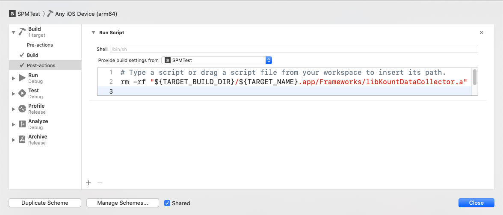
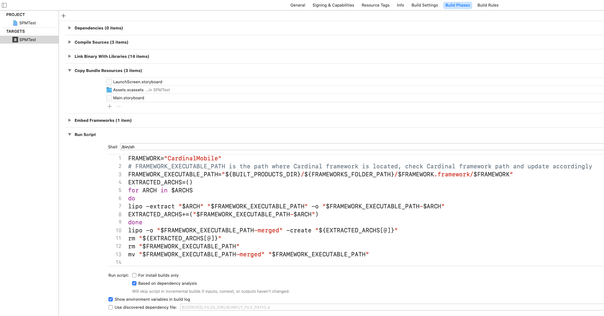

# Swift Package Manager Instructions

Braintree iOS v5.0.0 introduces support for Swift Package Manager.

To add the `Braintree` package to your Xcode project, select File > Swift Packages > Add Package Dependency and enter `https://github.com/braintree/braintree_ios` as the repository URL. Tick the checkboxes for the specific Braintree libraries you wish to include.

If you look at your app target, you will see that the Braintree libraries you chose are automatically linked as a frameworks to your app (see General > Frameworks, Libraries, and Embedded Content).

In your app's source code files, use the following import syntax to include Braintree's libraries. For example:
```
import BraintreeCore
import BraintreeCard
import BraintreeApplePay
import BraintreePayPal
```

#### Binary Dependencies

There is a known Xcode bug, reported in [this GitHub issue](https://github.com/braintree/braintree_ios/issues/576), on archiving apps that use binary dependencies via SPM. The workaround is to tick the checkbox to include these binary dependencies in your app.

To use the `BraintreeDataCollector` library, you must also include the `KountDataCollector` library via SPM.

The `PayPalDataCollector`, `BraintreePaymentFlow`, `BraintreeThreeDSecure`, `BraintreePayPal`, and `BraintreeVenmo` libraries all require the `PPRiskMagnes` library be included via SPM.

#### BraintreeDataCollector

There is a known bug that occurs when uploading static libraries packaged as xcframeworks for Swift Package Manager. To avoid this issue, you must add a post-action to your scheme's Build section that removes an extra copy of `libKountDataCollector.a`.


```
rm -rf "${TARGET_BUILD_DIR}/${TARGET_NAME}.app/Frameworks/libKountDataCollector.a"
```

Make sure to select your app's target in the "Provide build settings from" drop-down.



#### BraintreeThreeDSecure

To use the `BraintreeThreeDSecure` library via SPM, you must manually include the `CardinalMobile.framework` located in the `Frameworks` directory.

1. Once you've installed the Braintree Swift Package, find the `CardinalMobile.framework` under the Frameworks directory in the Braintree package.
1. Right click on `CardinalMobile.framework` and select _Show in Finder_.
1. Drag and drop `CardinalMobile.framework` from Finder into your Xcode project
    * Select _Copy items if needed_.
    * Click _Finish_.
1. Open your project's settings by selecting your app target in the General tab
    * Under the _Frameworks, Libraries, and Embedded Content_ section, make sure `CardinalMobile.framework` is set to “Embed & Sign”
1. Go to the Build Phases tab. Under _Link Binary With Libraries_, make sure the framework is listed. This should happen automatically, but if not, add the framework manually via the `+` button.

CardinalMobile.framework contains architectures for both devices and simulators. When uploading to App Store Connect, Xcode will emit an error if the simulator slice has not been removed. To avoid this error, you must add a run script that removes the unneeded architecture.

```
FRAMEWORK="CardinalMobile"
# FRAMEWORK_EXECUTABLE_PATH is the path where Cardinal framework is located, check Cardinal framework path and update accordingly
FRAMEWORK_EXECUTABLE_PATH="${BUILT_PRODUCTS_DIR}/${FRAMEWORKS_FOLDER_PATH}/$FRAMEWORK.framework/$FRAMEWORK"
EXTRACTED_ARCHS=()
for ARCH in $ARCHS
do
lipo -extract "$ARCH" "$FRAMEWORK_EXECUTABLE_PATH" -o "$FRAMEWORK_EXECUTABLE_PATH-$ARCH"
EXTRACTED_ARCHS+=("$FRAMEWORK_EXECUTABLE_PATH-$ARCH")
done
lipo -o "$FRAMEWORK_EXECUTABLE_PATH-merged" -create "${EXTRACTED_ARCHS[@]}"
rm "${EXTRACTED_ARCHS[@]}"
rm "$FRAMEWORK_EXECUTABLE_PATH"
mv "$FRAMEWORK_EXECUTABLE_PATH-merged" "$FRAMEWORK_EXECUTABLE_PATH"
```




Alternatively, you can run the following command prior to uploading your app.

```
lipo -remove x86_64 -output CardinalMobile.framework/CardinalMobile CardinalMobile.framework/CardinalMobile
```

